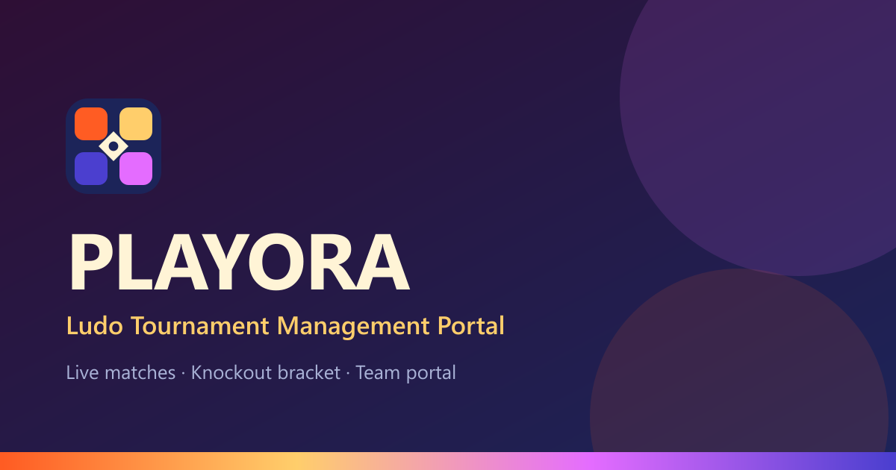

# 🎲 PLAYORA — Ludo Tournament Management Portal

A single-elimination Ludo tournament, run end to end from one console: the
organiser registers teams and issues their logins, draws the bracket, assigns
tables and kickoff times, publishes each round, and runs matches live.
Built with **Next.js 16 (App Router)**, **TypeScript** and **Tailwind CSS v4**.



---

## 🌟 What it does

PLAYORA covers three audiences from one codebase:

| Surface | Who it is for | What they get |
| --- | --- | --- |
| **Public hub** | Spectators, players | Live matches with a running clock, published fixtures, the knockout bracket, results, rules and contact |
| **Admin console** | The organiser | Create the tournament, register teams (logins issued automatically), draw the bracket, assign tables and times, publish rounds, run matches live |
| **Team portal** | Team captains | Their own fixtures, the bracket, notifications — **read-only** |

### How a tournament runs

1. **Create** the tournament (name and venue — the Cafe).
2. **Register teams.** Each team is issued a Team ID and an 8-character
   password on the spot; the organiser reads them out at the desk, or prints
   the whole credential sheet.
3. **Draw.** One tap pairs every team at random and locks the field. Round
   sizes halve automatically: **48 -> 24 -> 12 -> 6 -> 3 -> 2 -> 1**. An odd
   round gives one team a bye.
4. **Assign** a table and kickoff time to every match.
5. **Publish.** Only then do fixtures become visible to teams and to the
   public — and publishing is what notifies the teams.
6. **Run.** Start each match (it goes live with a clock), record who advanced,
   then advance the round. Repeat to a champion.

### No points table — on purpose

Lose once and you are out, so a league table carries no information: every
surviving team has won every match it played, and they would all sit level on
points. PLAYORA shows a **bracket** instead, which answers the question people
actually have — how far did each team get?

The visual language is a Ludo board: **Atomic Orange**, **Melted Mango**,
**Indigo Flame** and **Electric Orchid** over **Deep Plum** and **Vanilla**,
with full light and dark themes.

---

## ✨ Highlights

- **Ships empty, honestly.** No seed data, no invented teams. Every page shows
  a real empty state until the organiser sets the tournament up.
- **Animated sign-in.** The login page opens dim with a die on a cord; pull it
  and the die tumbles, lands, and the light comes up on the form. Skipped
  entirely under `prefers-reduced-motion`, and the form works whether or not
  you ever touch the animation.
- **Mobile first, verified.** No page scrolls horizontally at 320px. The
  admin console is a drawer on phones, the team portal has a bottom nav that
  respects safe-area insets, and the bracket scrolls round by round.
- **Accessible by default.** Skip link, visible focus rings, `aria-current`,
  Escape-to-close and focus return on drawers, semantic tables and landmarks,
  `prefers-reduced-motion` support, and WCAG AA contrast in both themes
  (verified by an automated sweep — see [Quality checks](#-quality-checks)).
- **Installable.** Web manifest, maskable icons and shortcuts, so a referee
  can add it to their home screen for the day.
- **SEO ready.** Per-page titles, descriptions, canonicals and Open Graph
  cards; `robots.txt` and `sitemap.xml` generated from the route list.
- **One source of truth.** The public hub, the admin console and the team
  portal all read the same store, so they can never disagree about a score,
  a table or who is still in.

---

## 🏗️ Project layout

```
Ludo_System/
├── frontend/                  # Next.js 16 · React 19 · TypeScript · Tailwind v4
│   ├── src/
│   │   ├── app/               # App Router routes (public, /admin, /team)
│   │   ├── components/        # cards, layout shells, tournament, ui primitives
│   │   └── lib/tournament/    # types, knockout engine, store
│   ├── public/                # icons, OG image, team photos
│   └── .env.example
└── docs/                      # PRD, UI system, architecture, DB, API reference
```

### Stack

| Layer | Choice |
| --- | --- |
| Framework | Next.js 16 (App Router, Turbopack) |
| Language | TypeScript (strict) |
| Styling | Tailwind CSS v4 with CSS-variable design tokens |
| Icons | lucide-react |
| Theming | next-themes (class strategy, follows the device by default) |
| Backend | Django REST + PostgreSQL + WebSockets *(specified in `docs/`, not yet wired)* |

---

## 🚀 Running locally

**Requirements:** Node.js 20+ and npm.

```bash
cd frontend
npm install
npm run dev
```

Open <http://localhost:3000>.

### Signing in

**Admin** credentials come from the environment, never from the repository.
Copy `.env.example` to `.env.local` (gitignored) and set:

```
NEXT_PUBLIC_ADMIN_EMAIL=...
NEXT_PUBLIC_ADMIN_PASSWORD=...
```

**Teams** sign in with the Team ID and password PLAYORA generates when the
organiser registers them. There are none until a tournament is set up.

> **Warning:** both checks happen in the browser, so `NEXT_PUBLIC_*` values are
> readable from the JS bundle. This keeps secrets out of git; it does not make
> the console secure. Move authentication to Django before running a real
> event, and never reuse a password from anywhere else.

---

## 🌍 Deploying for free

The app is fully static — every route prerenders — so any static-friendly
host works. **Vercel** is the shortest path.

### Vercel

1. Push to GitHub (this repo is already set up).
2. On [vercel.com](https://vercel.com) → **Add New → Project** → import
   `AbdurRafayBaig/PLAYORA`.
3. **Set Root Directory to `frontend`.** This is the one setting that matters
   — the Next app is not at the repo root, and the build fails without it.
4. Framework preset resolves to Next.js automatically; leave the build and
   output settings alone.
5. Add one environment variable:

   | Key | Value |
   | --- | --- |
   | `NEXT_PUBLIC_SITE_URL` | `https://<your-project>.vercel.app` |

   This drives canonical URLs, `sitemap.xml`, `robots.txt` and the Open Graph
   image URL. Without it they point at the placeholder domain and search
   engines index the wrong host.
6. Deploy. Later pushes to `main` redeploy automatically.

### Netlify / Cloudflare Pages

Same idea: base directory `frontend`, build command `npm run build`, and the
same `NEXT_PUBLIC_SITE_URL` variable. Netlify needs
`@netlify/plugin-nextjs`; Cloudflare Pages needs the Next.js preset.

---

## ✅ Quality checks

```bash
cd frontend
npm run check      # eslint + tsc --noEmit + next build
npm run test:e2e   # 95 assertions against the built app in real Chrome
```

`test:e2e` launches headless Chrome and drives the production build over the
DevTools Protocol — no test framework, no automation dependency. Three
suites: a full tournament played to a champion, an adversarial pass where
every check maps to a defect that was once shipped, and an accessibility and
layout sweep of every route in both themes. See
[`frontend/tests/README.md`](frontend/tests/README.md).

Each release of this branch was verified with:

- `next build` — every route prerenders, no type errors
- `eslint` — clean, including the React 19 hooks rules
- every route returning 200, and the 404 page rendering for unknown paths
- `npm run test:e2e` — 95 assertions, zero failures

---

## 🔌 Connecting the real backend

State currently lives in the browser's localStorage
(`frontend/src/lib/tournament/store.tsx`). **Two limits follow from that, and
both need the Django backend to fix:**

- A team login created on the organiser's laptop does not exist on a
  captain's phone. Cross-device access is not possible without a server.
- Passwords are compared in the browser, so they are not secret.

The app is shaped to port cleanly. Every store action (`addTeam`,
`publishRound`, `recordWinner`, `advanceRound` and the rest) maps one-to-one
onto a REST endpoint, and all the bracket maths already lives in
`frontend/src/lib/tournament/engine.ts` as pure, storage-free functions that
can be reimplemented in Python without reference to the UI. Types are in
`tournament/types.ts`; the endpoint contract is in
[`docs/06_API_Reference.md`](docs/06_API_Reference.md).

---

## 📄 Credits

Built by the PLAYORA team under **Tynovate**:

- **Abdur Rafay Baig** — Full Team Lead Architect, backend and frontend ([LinkedIn](https://www.linkedin.com/in/irafaybaig/))
- **Wajdan Ali** — Mobile Optimization
- **Ammar Ahmad** — Backend Architect

Questions or problems: **f233046@cfd.nu.edu.pk** · **0300 7562623**

Repository: <https://github.com/AbdurRafayBaig/PLAYORA>
