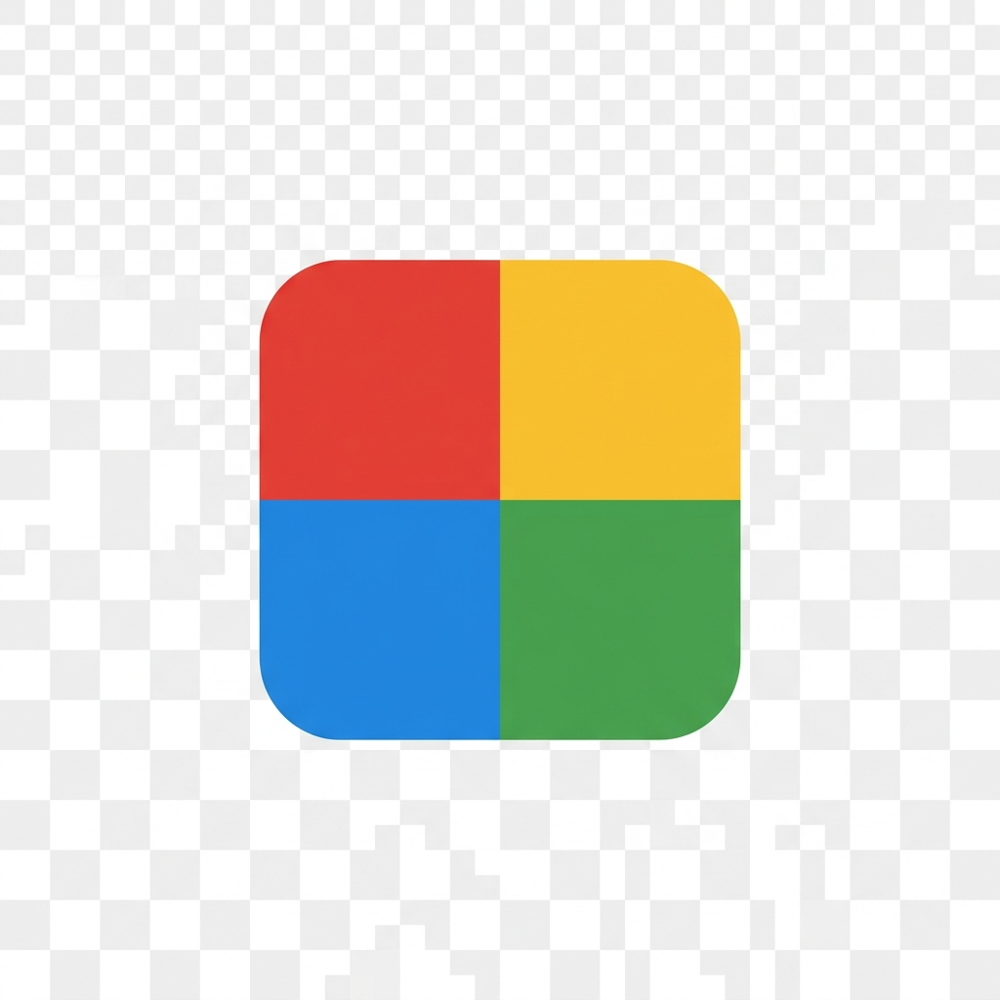

# 🎯 PLAYORA - Premium Tournament & Match Management System

> A state-of-the-art, Ludo-inspired digital tournament platform engineered with **Next.js 16 (App Router)**, **TypeScript**, **Tailwind CSS**, and **Django REST Framework**.



---

## 🌟 Overview

**PLAYORA** is built for high-energy tournament operations, live match scoring, dynamic odd-number team rotation, automated standing calculations, and multi-role user portals (Admin & Team Portals). 

Inspired by classic Ludo board mechanics, the visual design language utilizes a vibrant **Red (`#EF4444`)**, **Blue (`#3B82F6`)**, **Yellow (`#F59E0B`)**, and **Green (`#10B981`)** color system with modern dark/light theme switching.

---

## ✨ Key Features

- **🏆 Dynamic Landing Page**: Live match tracker, upcoming fixtures, recent results, interactive quick-nav grid, and platform showcase.
- **👑 Person / Team Showcase (About Us)**: Dedicated leadership & developer showcase (featuring CEO **Hassaan Ahmad**, Lead Developer **Abdur Rafay**, and Core Contributor **Zoraiz**), inspired by MessMeter with Ludo design aesthetics.
- **🛡️ Multi-Role Authentication**: Dedicated administrative and team login portals with role-aware color theme hints.
- **⚙️ Admin Dashboard**: KPI counters, match status monitoring, live court/board tracking, team management, and odd-team bye alerts.
- **⚔️ Team Portal**: Team dashboard, roster overview, upcoming matches, recent form, match history, and broadcast notifications.
- **📊 Public Hub**: Fixtures schedule, live match monitoring, standings/leaderboard table with rank movement badges, past results, and detailed tournament rules/contact.
- **🎨 Ludo Visual Identity**: Hand-crafted design system tokens, glassmorphism, responsive drawer layout, dark mode support.

---

## 🏗️ Architecture & Tech Stack

```
Ludo_System/
├── frontend/             # Next.js 16 + React 19 + TypeScript + Tailwind CSS
│   ├── src/
│   │   ├── app/          # App Router (Landing, About, Login, Admin, Team, Hub)
│   │   ├── components/   # Reusable UI cards, tables, badges, headers, footers
│   │   └── lib/          # Design tokens, color utilities, constants
│   └── public/           # Favicon, assets, SVG placeholders
└── docs/                 # Product requirements, UI system, Architecture docs
```

### Stack Detail
- **Frontend Framework**: Next.js 16 (Turbopack, App Router)
- **UI & Icons**: Tailwind CSS v4, Lucide React, Custom SVG Icons
- **Theme Engine**: `next-themes` (Dark / Light support)
- **Backend (Planned/Spec)**: Django REST Framework + PostgreSQL + WebSockets

---

## 🚀 Quick Start

### Prerequisites
- Node.js 18+
- npm / pnpm / yarn

### Run Frontend Locally

```bash
# Move to frontend directory
cd frontend

# Install dependencies
npm install

# Run dev server
npm run dev
```

Visit `http://localhost:3000` to view PLAYORA.

---

## 📄 License & Credits

Designed and developed by the **PLAYORA Core Team**:
- **Hassaan Ahmad** - CEO & Founder
- **Abdur Rafay** - Lead Full Stack Engineer
- **Zoraiz** - Product & Operations Lead

Repository: [PLAYORA on GitHub](https://github.com/AbdurRafayBaig/PLAYORA.git)
